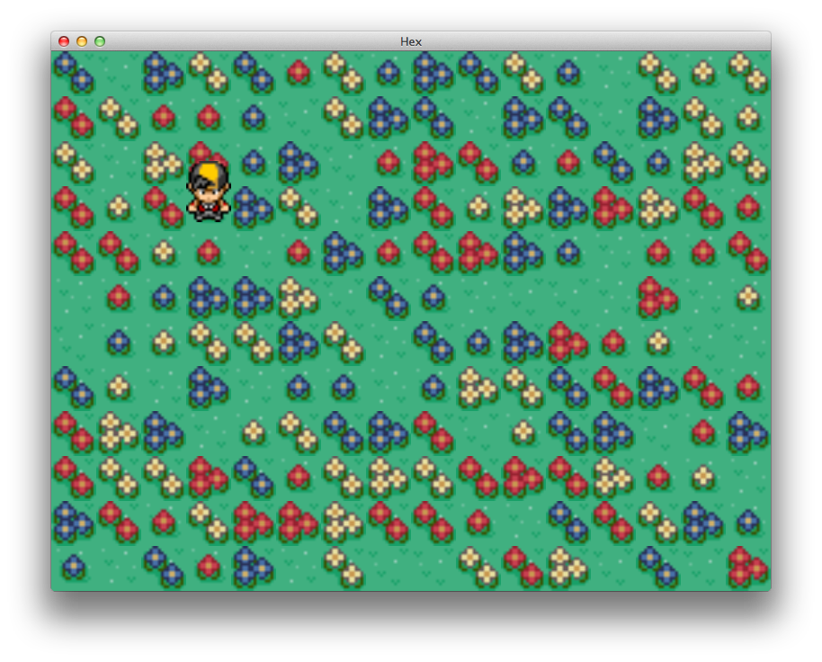

# HEX

Hex tile based game written using Kivy

This game is mainly a learning exercise in using Kivy

Assets:
- tiles: http://opengameart.org/content/hexagon-tiles-93x (`trees/`, `characters/`)
- tuxemon: http://opengameart.org/content/tuxemon-tileset (`tiles/`)
